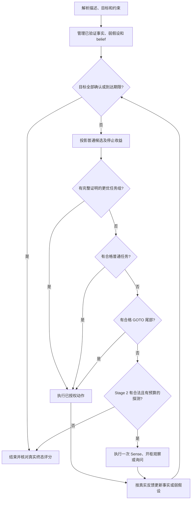

> 历史继承说明：本文对应 1.7.2 阶段；该阶段正式文档和证据见 [src1.7.2](../../src1.7.2/docs/ROBOT_FLOW.md)。本目录当前版结论以仓库根目录复核报告为准。

# src1.7.2 从输入到结束的决策流程

本说明对应本轮源码。真实评分与验证范围见 RELEASE_1.7.2.md。机器人能选择完成哪些目标，并不保证每道题的全部目标都可完成。

## 1. 建立当前状态

解析对象、机器人位置、手持/托盘、容器、目标和约束；非法索引和缺失绑定先经过原有输入检查。目标保留输入身份和重复计分语义。

Stage 2 的世界可能与初始描述不同。程序保留三层：真实世界在 SDK 内部；初始描述与询问形成本地假设；canonical 管理已有证据可确认的事实。事实冲突、失效或尚未验证时保持 UNKNOWN。程序不能直接读取 SDK 的隐藏真值来规划。

belief 另存位置/容器候选及概率，用于挑选下一次信息动作。它没有确认事实的权限。物体真的在哪里，要通过局部 Sense 或相应真实动作反馈逐渐确认。

## 2. 整理目标与初次验证

沿用现有任务绑定与优化流程。Stage 2 若任务不超过 24 项，初始描述声称某个非 GOTO 目标已经完成、但证据尚未确认，且有时间余量，沿用原来的当前位置 Sense。它只能观察当前位置；封闭容器里看不见的物体仍未知。

多个 GOTO 沿用原有尾部聚合流程，不在本轮扩展任务组支持范围。

## 3. 每轮先判断能否结束

用 canonical 检查全部目标。全部已确认满足就停止；到达期限也停止。只有描述看似满足，不等于已经完成。

未结束时，针对各任务做无副作用的投影：需要哪些原子动作、是否可完成、动作成本和预计时间、可能损失哪些现有目标或历史约束。投影结束恢复状态，不把模拟 Sense 当作真实观测。

基础分由最终目标、历史约束和动作成本决定，通常为 `40×G + 20×C − K`。官方分还包括时间奖励。决策中同时保留保守值与可能值，未确认收益不当作已获得收益。

## 4. 判断普通任务是否值得执行

过滤无法完成、净收益不足、时间不够、当前状态下刚失败或已达失败上限的任务。Stage 2 对输入位置、inside、容器状态等均已确认的任务，可以越过旧版的部分保守风险门槛；既有收益门和约束记分仍检查。

合格单任务按边际基础分排序，相同收益再比较预计时间和稳定输入身份。这个结果是本轮普通候选，并不是立刻执行命令。

## 5. 内部任务组检查

同一轮尝试有界 guarded 搜索，比较立即停止、普通计划的后续、任务组后停止、任务组后继续普通计划。单次最多 25 ms，整题累计最多 100 ms。

Stage 2 只允许相关输入已确认、完整路径不包含询问或感知假设的任务组。任务组的保守收益必须严格超过普通计划/停止的可能收益，并通过完整动作与损失检查；超时、不完整、无法证明或不在支持范围，就使用普通候选。

获选任务组携带授权动作序列。真实执行过程中结果、状态或动作不符合投影，立即退出组，回到真实反馈后的状态重规划。

## 6. 无普通正收益任务时补信息

先检查是否已有合格的 GOTO 尾部，避免探索打断现成收益。没有时，Probe 分析未知、冲突或依赖失效的阻塞事实。

若只是目标先后顺序使单任务负收益，不给它额外生成 AskLoc。否则生成有具体线索的当前位置 Sense、Move+Sense；满足严格前提时补充 Move+Open+Sense；缺少可验证位置时考虑单次 AskLoc。

默认保留已有 Sense 的完整排序（覆盖、目标机会、成本、时间、输入身份）；其次是开柜观察，最后是询问。概率与净收益用于资格检查和询问排序。每次只选一个合格信息动作，执行后立即回到第 3 步。

## 7. 探测的收益和预算

候选同时考虑信息概率、后续目标机会、探测成本、后续动作成本/时间、目标恢复成本和约束风险。重复目标按相同对象绑定分组，最多估三个执行组；不把一次询问当作全部目标已经完成。

`information_estimate` 是学到至少一项相关信息的估计；`expected_gain` 是未经校准的排序启发式。两者都不是官方分或已验证成功率。

单题最多 8 次 Probe、探测成本最多 32；普通探测 Sense 按地点最多 2 次，开柜探测观察按容器最多 2 次，同对象探测询问最多 3 次。原任务内部的信息动作继续使用原任务预算。一个探测用完次数，不会关闭其他合法探测。拿到可用回答后，相关证据未改变时不能反复询问它；not_known 允许少量重问，但不增加置信度。

开柜要求容器位置已确认、已关闭、空手，且没有已有目标或约束损失。Move+Sense 对至少 200 分的目标机会允许有界记分约束交换：整题最多涉及两项不同约束，每项按最坏损失 20 分估价，探测与后续净收益仍须为正。记分风险不等于放宽物理动作前提。

## 8. 处理真实反馈

Move/Open 失败就退出，不继续假设到达或打开后 Sense。动作入口再次检查白名单、状态和预算。

AskLoc 的合法答案可能是错的。它更新弱位置/容器假设及独立 belief；已确认事实冲突不覆盖，同一回答只累计一次，非法或未知回答不提高置信度。真实 Sense 的阴性证据只排除已经证明缺席的位置，不排除封闭容器内的可能性。

成功执行的 Stage 2 目标以后若被其他动作破坏，可以恢复；失败仍最多三次，整题步数上限继续生效。历史约束损失按已有账本保留，恢复动作不能重新取得已失去的历史信用。

## 9. 停止与报告

满足全部目标、到达期限、没有合格普通任务和合法探测、无进展或达到步数上限时停止；符合原条件时完成 GOTO 聚合/终态恢复。

最终以 canonical 与 SDK 终态核对目标，而非累计“曾执行成功”次数。日志记录候选拒绝原因、选中的动作、真实反馈、重新规划和探测后实际完成的目标。验收同时报告目标数、约束数、动作成本、基础分、官方分和超时，并保留退化。
