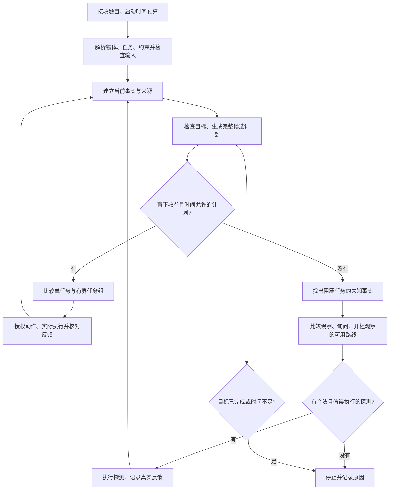

> 历史继承说明：本文对应 1.7.3；1.7.4 当前模型见 [JOINT_MODEL.md](JOINT_MODEL.md)，真实流程见 [ROBOT_FLOW_1.7.4.md](ROBOT_FLOW_1.7.4.md)。

# src1.7.3：机器人怎样一步步决定

本说明对应 src1.7.3 开发版。验证结果与尚未解决的问题见 [PROBABILITY_MODEL.md](PROBABILITY_MODEL.md)；普通规划和官方记分模块继承 src1.7.2。概率是规划线索，真实执行资格来自当前证据。

1. **进入题目。** 机器人重置上一题状态、探测次数、概率分布和路线缓存，并开始本题时间预算。解析环境、任务和约束；不安全的身份或索引不能进入执行。重复任务保留其官方记分次数。

2. **区分描述和事实。** 第一阶段按该阶段的输入契约规划。第二阶段的初始位置、询问回答属于可能错误的提示；观察或成功动作建立相应事实。有依据的约束推导还要检查支持依赖是否有效。概率升高不会自行把提示升级为事实。

3. **先判断目标状态。** 每个目标分为已确认完成、已确认未完成、未知。未知不能按已完成记分。已执行次数和任务顺序用于调度，不能代替真实终态。

4. **试算正常候选。** 复用原任务求解器，在完整快照内计算动作、目标变化、约束变化、成本和耗时。试算不调用平台。结束或异常后恢复现场。过滤不合格、未完成推演、没有正收益或预计来不及的候选，再稳定排序。

5. **比较组合任务。** 自动 guarded 搜索在既定时间上限内比较单任务、任务组合与停止。组合必须证明收益优于参考并且能完整执行；搜索不完整或超时就回到普通候选。普通候选执行后重新规划；任务组按完整授权路径执行，逐步核对状态和动作，出现变化或失败就退出组并重新规划。

6. **正常计划停滞时进入 Probe 层。** 查明哪一项位置或关系事实阻塞任务，生成当前位置观察、移动观察、询问，以及受限开柜观察。分别检查事实、重复次数、探测总成本、约束和剩余时间。普通观察目前仍保留原有经验排序与价值近似；它尚未全部替换为概率场景规划。

7. **询问前比较回答分支。** 对每个可能回答计算出现概率与后验。每个回答只允许选择一个后续验证路线，再与停止比较；不能按隐藏真值各选一条最优路线，假装机器人知道正确答案。问后的期望收益还要扣除问前已有机会、询问成本及时间。完整路线不足时的数值只是当前模型近似，不能证明探索没有收益。

8. **估计观察之后的资格。** 假设验证成功时，未来路线按隔离场景中的证据判断资格，且在任务行动前判断。随后恢复现场。真实机器人并未获得这份假设事实；实际执行仍要等待真实观察并再次授权。缓存仅节省已验证路线的重复计算，剩余探测成本和时间仍重新检查。

9. **收到回答。** 即使回答具体位置，也只更新概率和弱提示。不同真实调用给出相同回答可以累计信息；重复提交同一个事件不能重复累计。当前询问模型中的 not_known 不提供位置信息。随机回答也可能碰巧正确，所以“正确分支为 0.6”不等于“任何具体回答正确率都为 0.6”。

10. **实际验证。** 若询问后的模型选择了路线，它只是下轮观察的优先提示。真实 Sense 返回可见物体 ID：它能确认地点，但开放柜内和柜旁的物体可能同时可见，不能据此确认柜外。关闭或未知柜门下没看到，不等于物体不在柜内；可信开柜后仍未看到才排除相应柜内假设。实际成功的拿取、放置、开关等反馈才能确认相应物理关系。

11. **反馈后重新开始判断。** 更新事实、约束账本和位置概率，检查受阻任务是否恢复，重新计算完整候选。失败需要结合前提与反馈判断，不能把每次失败都当成确定的“不存在”，也不能无限重复尝试。

12. **结束。** 目标完成、期限不足、探测次数/成本达到上限，或当前没有合格计划与探测时停止；保留停止原因、已完成目标、动作成本和时间。模型覆盖不完整导致的停止仍是开发问题。最后通过既有同步机制等待规划退出后清理现场，避免 SDK 结束线程与规划线程同时操作物体。

查看日志时，依次对应 `blocked_task`、`candidate`、`execute`、`feedback`、`replan`、`stop`。候选中的回答分支是预测；实际回答、动作结果与官方终态才是验证依据。
